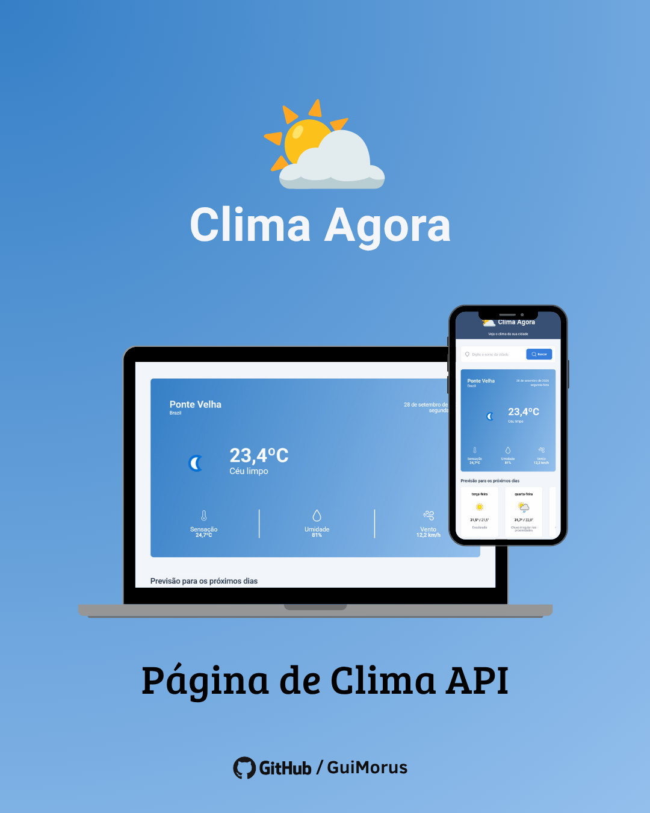

# ☀ Projeto - Clima Agora

Este projeto é uma aplicação de previsão do tempo desenvolvida **do zero**, com o objetivo de praticar o consumo de APIs, manipulação de dados e organização de uma aplicação JavaScript mais modular.

A aplicação permite pesquisar uma cidade e consultar as condições climáticas atuais, além da previsão para os próximos dias. As informações são obtidas através da **WeatherAPI**, incluindo temperatura, sensação térmica, condição do tempo, umidade, vento e previsão futura.

## 📷 Media

## 🚀 Tecnologias & Técnicas

- HTML5
- CSS3
- JavaScript
- Webpack
- Babel
- Day.js
- WeatherAPI
- ES Modules
- DOM Manipulation
- Event Listeners
- Fetch API
- API Requests
- JSON
- Desestruturação de objetos
- Async/Await
- Promises
- Renderização dinâmica
- Manipulação de datas
- Modular JavaScript
- Responsive Design
- Organização de projeto

## 💡 Comentários

Este projeto foi desenvolvido inteiramente do zero, utilizando a WeatherAPI para consultar as condições climáticas atuais e a previsão dos próximos dias, com informações em português (pt-BR) e ícones para cada condição climática.

Durante o desenvolvimento, coloquei em prática conhecimentos de Webpack, Babel, Fetch API, Async/Await, desestruturação de objetos e modularização do JavaScript, organizando o código em diferentes arquivos e responsabilidades.

O projeto também representa uma evolução em relação a uma aplicação anterior de previsão do tempo, permitindo aprofundar meus conhecimentos em consumo de APIs e desenvolvimento de aplicações JavaScript mais organizadas e próximas de projetos reais.

## 📚 Aprendizados

Neste projeto pratiquei:

- **WeatherAPI:** consumo de uma API externa para obter informações climáticas atuais e previsão dos próximos dias.
- **Fetch API:** realização de requisições HTTP e obtenção dos dados da API.
- **Async/Await:** utilização de funções assíncronas para trabalhar com requisições e respostas.
- **JSON:** leitura, desestruturação e manipulação dos dados retornados pela API.
- **Desestruturação:** extração de informações específicas de objetos retornados pela API.
- **DOM (Document Object Model):** seleção e manipulação dos elementos da interface.
- **Event Listeners:** gerenciamento das interações realizadas pelo usuário.
- **Renderização dinâmica:** atualização das informações da página de acordo com os dados recebidos.
- **Day.js:** manipulação e formatação das datas retornadas pela API.
- **Webpack:** configuração do processo de desenvolvimento e empacotamento da aplicação.
- **Babel:** utilização de recursos modernos do JavaScript através de transpilação.
- **JavaScript modular:** divisão da aplicação em diferentes arquivos e módulos, separando responsabilidades.
- **ES Modules:** utilização de `import` e `export` para comunicação entre os módulos.
- **API Requests:** construção de requisições utilizando parâmetros definidos pelo usuário.
- **Tratamento de dados:** organização das informações recebidas da API para utilização na interface.
- **Organização de projetos:** separação de arquivos, módulos e responsabilidades dentro da aplicação.
- **JavaScript moderno (ES6+):** utilização de recursos modernos da linguagem.

## 🔗 Projeto

- **Deploy:** [Project - Clima Agora](https://guimorus.github.io/project-clima/)

## 🎖 Créditos

Este projeto ganhou vida pelas mãos de **Guilherme Moreira** como parte dos meus estudos em desenvolvimento Front-end.

Esta aplicação foi **desenvolvida do zero**, utilizando os conhecimentos adquiridos durante meus estudos de JavaScript, consumo de APIs, Webpack, Babel e modularização de código.

O projeto foi desenvolvido com fins educacionais, buscando praticar a construção de uma aplicação funcional que consome dados externos, processa informações e apresenta os resultados de forma dinâmica ao usuário.
